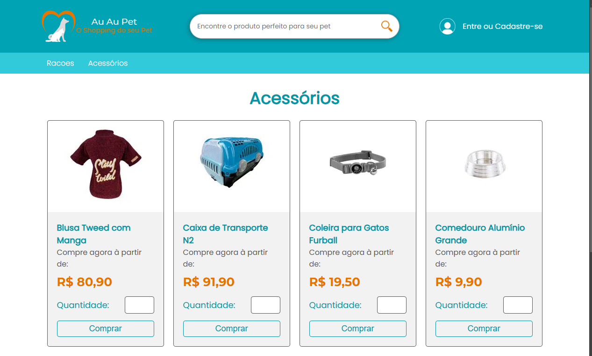

# AuAuPet E-commerce - Projeto de Estudo



## Descrição

Este é um projeto de loja virtual desenvolvido para a disciplina de **Desenvolvimento Web 1** durante meus estudos na **FATEC**. O objetivo do projeto é aplicar técnicas de requisições AJAX para carregar dinamicamente os produtos e a tabela administrativa do site. O e-commerce foca em produtos veterinários e petshop em geral, oferecendo uma interface simples e funcional, com uma área para clientes e uma área administrativa (adm).

## Estrutura do Projeto

A estrutura do site inclui uma página principal (`index.html`) e outras seis páginas, cada uma representando uma seção do site e carregada dinamicamente via AJAX pelo menu de navegação.

### Estrutura de Arquivos

```plaintext
├── assets                   # Pasta com recursos de imagem e mídia
│   ├── images               # Imagens como logo, favicon e ícones
│   ├── acessorios           # Imagens de produtos da seção de acessórios
│   └── racoes               # Imagens de produtos da seção de rações
├── acessorios.html          # Página da seção de acessórios
├── clientelogado.html       # Página de catálogo para clientes logados
├── dashboardadm.html        # Página inicial para o administrador
├── estoque.html             # Página de estoque para o administrador
├── index.html               # Página principal do site
├── login.html               # Página de login para clientes e adm
├── racoes.html              # Página da seção de rações
├── script.js                # Arquivo JavaScript com funções AJAX e outras funcionalidades
└── style.css                # Arquivo CSS para estilização do site
```

## Funcionalidades do Site

### Visão Geral do Site

- **Home Page (`index.html`)**: Página inicial com informações sobre o e-commerce.
- **Menu de Navegação com AJAX**: Todas as páginas são carregadas via AJAX, proporcionando uma navegação rápida e fluida.

### Área do Cliente

- **Login de Cliente**: Acessível com qualquer e-mail e a senha "1234" para simular a verificação de senha e exibir/ocultar senha.
- **Página Cliente Logado (`clientelogado.html`)**: Exibe o catálogo de produtos carregado dinamicamente via AJAX após login.
- **Formulário de Cadastro de Cliente**: Inclui integração com a API do **ViaCEP** para preencher o endereço automaticamente e formatação de campos de **CEP**, **telefone** e **CPF** com JavaScript.

### Área do Administrador

- **Login de Administrador**: Simulado com e-mails terminados em `@auaupet.com` e senha "1234". Esse acesso leva à interface administrativa.
- **Dashboard do Administrador (`dashboardadm.html`)**: Página inicial do administrador após o login.
- **Página de Estoque (`estoque.html`)**: O estoque de produtos é carregado via AJAX, permitindo a visualização rápida dos itens em estoque.

### Requisições AJAX

- As requisições AJAX são usadas para carregar as páginas e conteúdo dinâmico:
  - **Produtos**: Catálogos de produtos para clientes logados.
  - **Tabela de Estoque**: Visualização do estoque de produtos para administradores.

## Tecnologias Utilizadas

- **HTML5** e **CSS3**: Estrutura e estilização das páginas.
- **JavaScript**: Funções de AJAX, validação e formatação de formulários.
- **API ViaCEP**: Para preenchimento automático de endereço no formulário de cadastro.

## Como Executar o Projeto

1. Clone o repositório:
  ```bash
  git clone https://github.com/seuusuario/nomedoprojeto.git

2.Navegue até a pasta do projeto
  ```bash
  cd nomedoprojeto
  ```

3.Abra o arquivo index.html em um navegador para visualizar o site.
  ```bash
  Nota: Este projeto é uma simulação, sem integração com back-end. Portanto, a funcionalidade de login e manipulação de estoque é apenas ilustrativa.
  ```

## Autor

Desenvolvido por Raphael como parte de estudos em desenvolvimento web.

## Licença

Este projeto é de uso livre para fins de aprendizado. Se usar partes deste projeto, por favor, dê os devidos créditos.